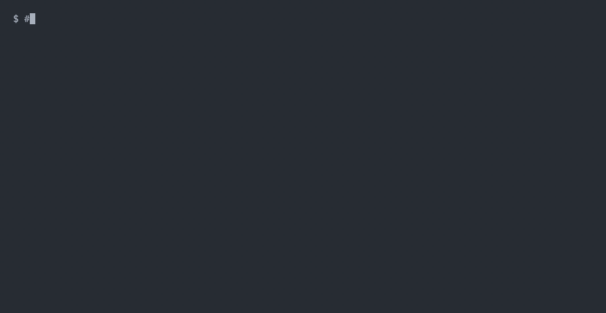
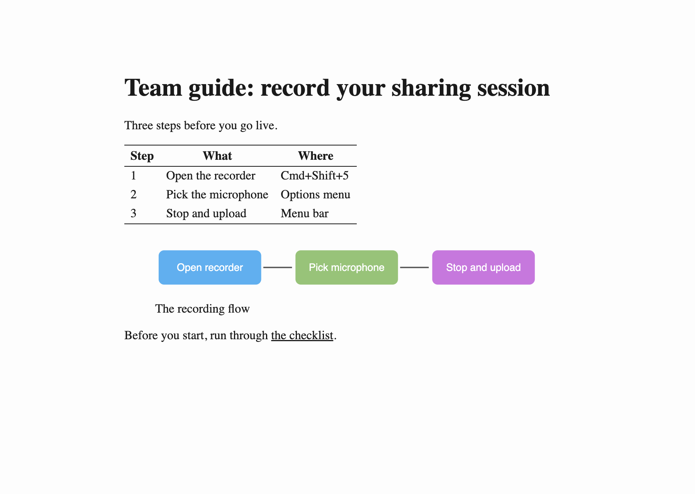

# share

Publish a snapshot of a local file or folder at a short link on your own domain. It works like ngrok, but the hostname is yours and stays the same. Anyone with the link can open it while your machine is awake.

```sh
brew install dwarvesf/tools/share
share setup s.example.com       # log in to Cloudflare in the browser; share does the rest
share add ./team-guide          # https://s.example.com/62cb50/team-guide/  (copied to clipboard)
```




What the visitor sees (a shared folder's `README.md`, rendered):



These are real recordings of the Homebrew build against a live domain; [demo/](demo/) reproduces them. The setup recording uses an API token; without one, setup first opens the Cloudflare login in your browser.

## What you get

| Behavior | Detail |
|---|---|
| Short, stable link | `https://<your-host>/<id>/<name>`. The random 6-hex `id` keeps links unguessable. |
| Snapshot, not a live mount | `share add` copies the file or folder. The link keeps working after the source is deleted, for example a removed git worktree. `share refresh <id>` updates the copy under the same link. |
| Live dev server | `share add 3000` proxies `https://<host>/<id>/` to `127.0.0.1:3000` while the server runs. Ports below 1024 and share's own ports are refused: a live link exposes whatever answers on that port to anyone who has it. |
| Own hostname | `share add <...> --host dev.example.com` gives the share `https://dev.example.com` itself (one CNAME + one tunnel rule, removed by `share rm`). Apps that emit absolute paths (`/static/...`), which break under a path prefix, work here. Needs a credential that can edit DNS. |
| Folder index | A shared folder without `index.html`/`README.html` lists its files at the link. `--no-index` keeps the old 404. |
| Safe copy | Dotfiles (`.git`, `.env`) and symlinks are never copied, so a shared folder cannot leak secrets or point at `~/.ssh`. |
| Markdown | With pandoc installed, every `.md` also gets an `.html` render, styled for reading (light and dark, math via KaTeX); links between `.md` files point at the renders. |
| Expiry | Shares expire after 30 days by default (`--ttl 12h`, `--ttl 7d`, `--ttl never`). |
| No caching, no indexing | Every response carries `Cache-Control: no-store` and `X-Robots-Tag: noindex, nofollow`. `share rm` takes effect at once. |
| Visitor count | `share hits <id>` counts requests and unique visitor IPs. |
| Always on while awake | Setup installs a login service (launchd on macOS, systemd on Linux). Links come back by themselves after a reboot. |

Links are live only while the machine is awake. When it sleeps, visitors get Cloudflare error 530.

```
 visitor                                             your machine
 ───────                                             ────────────────────────────────────────────
 https://s.example.com/62cb50/guide/                 ~/share/pub/62cb50/guide/  (a snapshot copy)
        │                                                          ▲
        ▼                                                          │ files
 Cloudflare edge ─── Cloudflare Tunnel (outbound) ───▶ cloudflared ─▶ caddy on 127.0.0.1:8787
 TLS, DNS                                            login service   no listing, no-store, noindex
```

## Install

You need a domain on Cloudflare (the free plan works).

**Homebrew (macOS and Linux):**

```sh
brew install dwarvesf/tools/share
```

This pulls in `caddy`, `cloudflared`, and `jq`. For markdown rendering and the private-repo warning, also `brew install pandoc gh`.

**From a clone:**

```sh
git clone https://github.com/dwarvesf/share.git && cd share && ./install.sh
```

`install.sh` installs missing dependencies with Homebrew when it is present and symlinks `bin/share` into `~/.local/bin`, so `git pull` updates it. `./install.sh --with-extras` also installs pandoc and gh; `PREFIX=/usr/local/bin ./install.sh` changes where the symlink goes.

## Set up

```sh
share setup s.example.com
```

Setup opens Cloudflare in your browser. Pick the domain and click **Authorize**. share then does everything else:

```
auth:       browser login (~/.config/share/cert.pem)
zone:       example.com
tunnel:     created share-s-example-com
route:      s.example.com -> 127.0.0.1:8787
dns:        CNAME s.example.com -> tunnel
token:      stored in keychain (service share-tunnel:s.example.com)
service:    runs at login (foundation.d.share)
ready:      https://s.example.com/ is live. Next: share add <file|dir>
```

It checks that the hostname is free before it creates anything, then proves the link answers from the public internet. Running setup again is safe: it reuses what exists. On a server with no browser, set `CLOUDFLARE_API_TOKEN` instead ([docs/setup.md](docs/setup.md)).

## Use

| Command | What it does |
|---|---|
| `share add [--ttl 7d] <file\|dir>` | Copy it in, print the link, copy it to the clipboard, start serving if needed. |
| `share ls` | List shares with link, size, source, and expiry. Flags shares whose source is gone. |
| `share refresh <id\|link>` | Re-copy from the source path. The link stays the same. |
| `share rm <id\|link>` | Unpublish now. The copy goes to the Trash. |
| `share hits <id\|link>` | Requests and unique visitors for one share. |
| `share prune` | Unpublish every expired share now. It also runs every hour while serving, and before `ls` and `status`. |
| `share` | Server state, service state, and the share list. |
| `share stop` / `share start` | Take every link down / bring them back. With the service installed, `stop` lasts until the next login. |
| `share service install\|uninstall\|status` | Manage the login service. Setup installs it; `--no-service` skips that. |
| `share serve` | Serve in the foreground until Ctrl-C. |
| `share setup [hostname]` | Create or repair the Cloudflare side. |
| `share teardown [--yes]` | Delete the tunnel, service, stored token, and config, plus the DNS record when `CLOUDFLARE_API_TOKEN` is set (the browser-login token cannot delete DNS records). Shares on disk stay. |

A share from a private GitHub repo prints a warning, because the content is now public to anyone with the link.

## Configuration

Setup writes `~/.config/share/config` (`$XDG_CONFIG_HOME/share/config`). It is plain `key=value`, read without being executed.

| Key | Meaning |
|---|---|
| `hostname` | Public hostname, for example `s.example.com`. |
| `tunnel_id`, `tunnel_name` | The Cloudflare Tunnel that setup created or reused. |
| `auth` | `login` (browser) or `api` (API token): how setup authorized. |
| `hosts` | Space-separated short hostnames allowed to serve (`uname -n` up to the first dot). Setup writes the current machine, because two machines on one tunnel would split requests between two different share folders. |
| `port` | Local port caddy listens on. The tunnel route points at it. Default `8787`. |
| `ttl` | Default expiry for `share add`. Default `30d`. |
| `token_cmd` | Optional command that prints the tunnel token, for example a 1Password read. It overrides the Keychain and the token file. |

Environment variables override the file: `SHARE_HOSTNAME`, `SHARE_HOSTS`, `SHARE_PORT`, `SHARE_TTL`, `SHARE_ROOT` (default `~/share`), `SHARE_CONFIG_DIR`, `SHARE_SERVICE_LABEL`, `SHARE_CLIPBOARD=0`, `SHARE_TUNNEL=0` (serve locally without the tunnel).

## Security model

- A link is public: anyone who has it can open it. Treat `share add` as publishing.
- Links contain a random id and the root has no listing, so nobody can browse or guess other shares.
- Only regular files are copied. Dotfiles and symlinks are skipped.
- Nothing outside `~/share/pub` is reachable. The index, logs, and config sit outside it.
- The tunnel token lives in the macOS Keychain, or in a mode-600 file on Linux, or behind your own `token_cmd`. Neither token ever appears in `ps` output.
- caddy listens on `127.0.0.1` only. The tunnel connects outbound, so no inbound port opens.

## Development

```sh
bash tests/share.sh      # every behavior except the tunnel; no credentials needed
shellcheck bin/share install.sh tests/share.sh
```

CI runs both on Ubuntu and macOS. The Cloudflare side needs a real zone and token, so `tests/e2e.sh` runs it by hand before a release: setup, a setup rerun, publish and fetch, restart, remove, and teardown, then an API check that nothing is left behind.

```sh
SHARE_E2E_HOST=share-e2e.example.com CLOUDFLARE_API_TOKEN=... tests/e2e.sh           # API-token setup
SHARE_E2E_HOST=share-e2e.example.com CLOUDFLARE_API_TOKEN=... tests/e2e.sh --login   # browser-login setup (one click)
```

The GIFs are real recordings; `demo/*.tape` reproduces them with [vhs](https://github.com/charmbracelet/vhs).

## Docs

- [docs/setup.md](docs/setup.md): browser login or API token, what setup creates, the service, moving machines, teardown, troubleshooting.
- [docs/how-it-works.md](docs/how-it-works.md): architecture, files on disk, and the reason for each design choice.

## License

MIT
