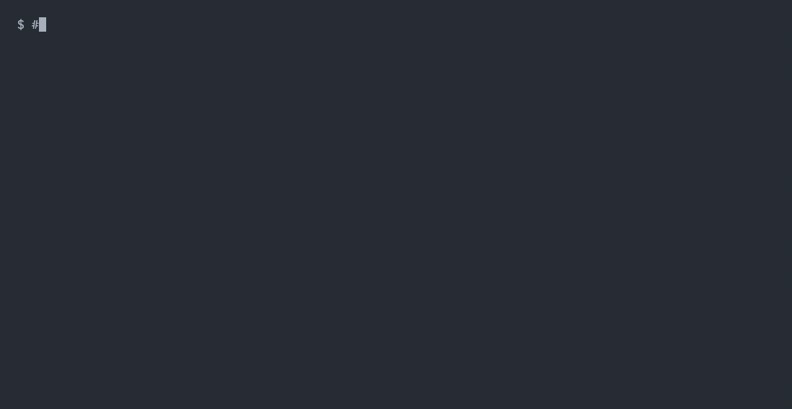

# share

[](https://github.com/dwarvesf/share/actions/workflows/ci.yml)
[](https://developers.cloudflare.com/cloudflare-one/connections/connect-networks/)
[](https://webuild.community)

Publish a local file, folder, or running dev server at a link on your own domain. Like ngrok, but the hostname is yours and stays the same.

```sh
brew install dwarvesf/tools/share
share setup s.example.com       # browser opens for Cloudflare login; share does the rest
share add ./team-guide          # https://s.example.com/62cb50/team-guide/  (copied to clipboard)
```



A second account or hostname on the same machine is a profile, with its own tunnel, port, and login service:

```sh
CLOUDFLARE_API_TOKEN=... share --profile work setup s.work.example   # no browser: a token for that account
share --profile work add ./guide                                     # https://s.work.example/62cb50/guide/
share profiles                                                       # default and work, each with its state (setup --quick works per profile too)
```

## Features

| | |
|---|---|
| **Stable links** | `https://<your-host>/<id>/<name>`; the random id keeps links unguessable |
| **Snapshots** | `share add <file\|dir>` copies it; the link survives deleting the source. `share refresh` updates under the same link |
| **Live dev servers** | `share add 3000` proxies `127.0.0.1:3000` while it runs |
| **Own hostname per share** | `--host dev.example.com` for apps that emit absolute paths |
| **Folder index** | folders without `index.html` list their files (`--no-index` to refuse) |
| **Markdown rendering** | with pandoc, `.md` renders in [Spacedown](https://github.com/dwarvesf/spacedown)'s paper reading theme (light/dark, KaTeX math) |
| **Safe copy** | dotfiles (`.env`, `.git`) and symlinks are never copied |
| **Expiry** | 30 days by default; `--ttl 12h\|7d\|never` |
| **Visitor counts** | `share hits <id>`: requests and unique IPs |
| **No domain needed** | `share setup --quick` serves at a random `trycloudflare.com` URL |
| **Agent-native** | `share skill --install` drops a SKILL.md for Claude Code and friends |
| **Always on** | a login service (launchd/systemd) brings links back after reboot |
| **Menu bar app** | Share Bar shows what's shared and lets you drag a file onto the icon to publish it |
| **Profiles** | `share --profile work ...` runs a second setup (another account or hostname) beside the first, on its own port and service |
| **Private links** | `--access email:a@x,b@y`, `domain:example.com`, or `group:<rule group>` puts a Cloudflare Access login (one-time PIN) on one link; the other links stay public. See [Private links](#private-links) |

Links are live only while the machine is awake; visitors get Cloudflare 530 when it sleeps. `https://<hostname>/healthz` answers `ok` while share is serving; the site root 404s by design.

## How it works

```
visitor                                              your machine
───────                                              ────────────────────────────
https://s.example.com/62cb50/guide/                  ~/share/pub/62cb50/guide/
       │                                                          ▲ files
       ▼                                                          │
Cloudflare edge ──── outbound Tunnel ────▶ cloudflared ──▶ caddy on 127.0.0.1:8787
TLS, DNS                                 login service    no-store, noindex
```

`share add` copies into `~/share/pub`, caddy serves it on localhost, and an outbound Cloudflare Tunnel publishes it at your hostname. Nothing outside `~/share/pub` is reachable, no inbound port opens, and the tunnel token lives in the Keychain (or a mode-600 file on Linux). Detail: [docs/how-it-works.md](docs/how-it-works.md).

## Install

```sh
brew install dwarvesf/tools/share    # macOS and Linux; pulls caddy, cloudflared, jq
```

Optional extras: `brew install pandoc gh` (markdown rendering, private-repo warning).

No Homebrew:

```sh
curl -fsSL https://raw.githubusercontent.com/dwarvesf/share/main/install.sh | bash
```

From a clone: `git clone https://github.com/dwarvesf/share.git && cd share && ./install.sh` (symlinks `bin/share`, so `git pull` updates it).

## Commands

```sh
share setup s.example.com   # one-time: tunnel, DNS, login service (--quick: no domain; --no-service: no login service)
share add <file|dir|port>   # publish, print + copy the link
share add ... --access <rule>   # a login gate on this link: email:a@x,b@y | domain:example.com | group:<name>
share api-token             # once per profile, the Cloudflare API token --access needs (--cmd '<command>' | --check)
share ls                    # shares with link, size, source, expiry
share refresh <id|link>     # re-copy from source under the same link
share rm <id|link>          # unpublish (copy goes to Trash)
share hits <id|link>        # request and visitor counts
share state                 # JSON snapshot for the menu bar app
share stop | start          # take all links down / bring them back
share teardown [--yes]      # remove tunnel, service, and config; the shares on disk stay
share --profile <name> ...  # any command against another setup (or SHARE_PROFILE=<name>); share profiles lists them
```

A share from a private GitHub repo prints a warning; the content is public to anyone with the link.

## Private links

Share a link that only named people can open (Cloudflare Access, email one-time PIN). This needs a named setup (`share setup <hostname>`, not `--quick`) on a Cloudflare account with Zero Trust enabled. If that host is not your default profile, put `--profile <name>` before the verb in every command below.

1. Give share a Cloudflare API token, once per profile.

   Already have a token with Access permissions (Apps and Policies Edit; Organizations, Identity Providers, and Groups Read; Zone Read)? Point share at it:

   ```sh
   share api-token --cmd 'op read "op://Private/cloudflare token/credential"'
   ```

   Otherwise run `share api-token`: it opens the Cloudflare token form with those permissions filled in. Click Create, paste the token, done. share checks the permissions either way.

2. Publish for named people:

   ```sh
   share add ./report.pdf --access email:a@example.com,b@example.com
   ```

   or for everyone at one email domain: `--access domain:example.com` (share warns that this admits every address at the domain, contractors included). The link prints once Cloudflare enforces the login, which can take a few minutes the first time; Ctrl-C during the wait is safe, nothing is published.

3. Next step, a reusable list: create a rule group once in the Cloudflare dashboard (Zero Trust > Access controls > Policies > Rule groups > Add a group; include each person's email), then:

   ```sh
   share add ./report.pdf --access group:<group name>
   ```

`share rm` of a gated link removes its Access app too (it needs the same token). A link that expires while nobody holds the token keeps its app in a waiting list; `share status` shows the count and the next `share prune` with the token clears it. Detail: [docs/how-it-works.md](docs/how-it-works.md#a-gated-share---access), scopes and troubleshooting: [docs/setup.md](docs/setup.md#4e-private-links-the-api-token-for---access).

## Menu bar app

```sh
brew install --cask dwarvesf/tools/share-bar    # macOS; also pulls the share formula
```

Share Bar is a menu bar icon for share: no terminal needed to see what's shared or to
publish something new. Click the icon for the current state and the share list, each
with Copy Link, Open in Browser, Refresh, and Remove. Drop a file or folder on the icon
to run `share add` on it.

First run, before anything is set up:

| State | Header | What you can do |
|---|---|---|
| CLI missing | `share CLI not found` | Copy Install Command |
| Not set up | `Not set up` | Set Up… (hostname, or quick mode with no domain) |
| Stopped | `Stopped` | Start Sharing |
| Serving | `Serving at <host>` | the share list, Stop Sharing |

The app only reads through the CLI (`share state`) and only acts through the CLI's own
verbs; it never touches `~/share` directly. To see what the app is doing, `log stream
--predicate 'subsystem == "foundation.d.share.bar"'` shows every CLI call and action.

## Docs

- [docs/setup.md](docs/setup.md): API token setup (no browser), moving machines, troubleshooting
- [docs/how-it-works.md](docs/how-it-works.md): architecture, config keys, security model, testing

## License

MIT
